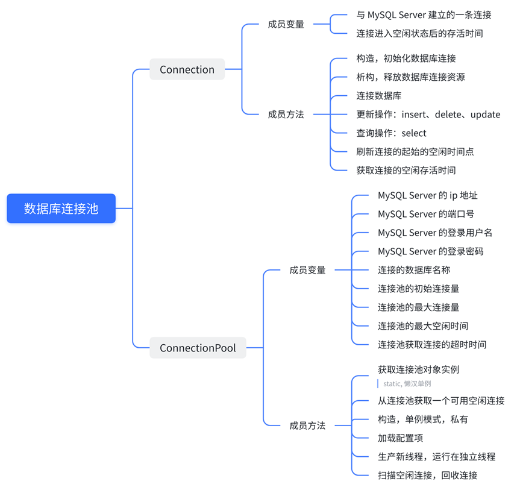
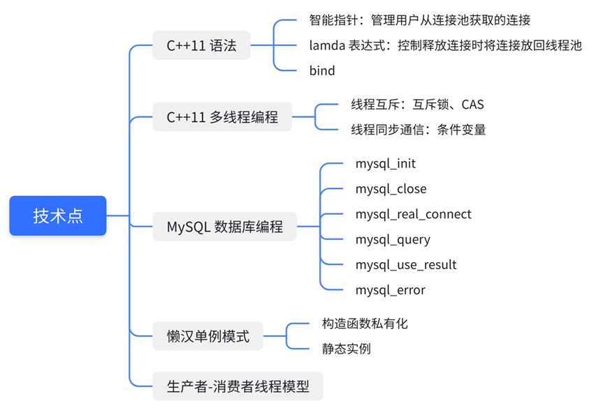

# ConnectionPool
基于 C++ 的 MySQL 数据库连接池

## 目录

+ [背景介绍](#背景介绍)
+ [下载安装](#下载安装)
+ [项目设计](#项目设计)
+ [关键技术点](#关键技术点)
+ [连接池压力测试](#连接池压力测试)

## 背景介绍


服务器作为 MySQL Clinent 访问 MySQL Server，需要经过 **TCP 三次握手建立连接、MySQL Server 连接认证、MySQL Server 关闭连接回收资源、TCP 四次挥手断开连接**，在高并发场景下，这些处理会明显耗费时间，降低服务器性能。为了提高 MySQL 数据库的访问瓶颈，通过增加连接池，即预先建立一定数量的 MySQL 连接，服务器访问数据库时从中取用，避免频繁的创建连接、断开连接所带来的性能损耗，从而提高 MySQL Server 的访问效率。

## 下载运行

+ 下载

    ```bash
    $ git clone https://github.com/Chang-Chiang/ConnectionPool.git
    ```
    
+ 手动编译测试

    ```bash
    $ cd ConnectionPool/test
    $ g++ -g -o thread_w_connectionpool thread_w_connectionpool.cpp -I../include ../src/*.cpp -lmysqlclient -lpthread
    $ ./thread_w_connectionpool
    ```

+ 编译动态库

  ```bash
  $ cd ConnectionPool
  $ mkdir build
  $ cd build
  $ cmake ..
  $ make
  ```

## 项目设计



## 关键技术点



## 连接池压力测试

### 创建测试用数据库、表

```mysql
# 创建用于测试的数据库
create database test_connectionpool;

# 切换至新建的数据库
use test_connectionpool;

# 删除表
drop table if exists user;

# 创建用于测试的表
CREATE TABLE `user` (
  `id` int(11) NOT NULL AUTO_INCREMENT,
  `name` varchar(50) DEFAULT NULL,
  `age` int(11) DEFAULT NULL,
  `sex` enum('male','female') CHARACTER SET latin1 DEFAULT NULL,
  PRIMARY KEY (`id`)
) ENGINE=InnoDB AUTO_INCREMENT=1 DEFAULT CHARSET=utf8;

# 查看表描述
desc user;

# 删除表中数据
delete from user;
```

### 测试代码

> 注意：测试代码中的计时在 windows 和 linux 平台的区别，利用宏 CLOCKS_PER_SEC 统一成秒

+ [单线程未使用连接池](./test/thread_wo_connectionpool.cpp) 
+ [单线程使用连接池](./test/thread_w_connectionpool.cpp) 
+ [二线程未使用连接池](./test/threads_wo_connectionpool.cpp)
+ [二线程使用连接池](./test/threads_w_connectionpool.cpp)

### 测试结果

> :white_check_mark:多线程连接数据库基本没提升的原因？

+ 环境一：windows11 - wsl2 - Ubuntu 22.04 LTS

  ```bash
  $ lsb_release -a
  No LSB modules are available.
  Distributor ID: Ubuntu
  Description:    Ubuntu 22.04 LTS
  Release:        22.04
  Codename:       jammy
  
  # 总核数 = 物理 CPU 个数 X 每颗物理CPU的核数 
  # 总逻辑CPU数 = 物理CPU个数 X 每颗物理CPU的核数 X 超线程数
  
  # 查看物理CPU个数
  $ cat /proc/cpuinfo| grep "physical id"| sort| uniq| wc -l
  1
  
  # 查看每个物理 CPU 中 core 的个数(即核数)
  $ cat /proc/cpuinfo| grep "cpu cores"| uniq
  6
  
  # 查看逻辑CPU的个数
  $ cat /proc/cpuinfo| grep "processor"| wc -l
  12
  ```

    | 数据量 | 未使用连接池花费时间 | 使用连接池花费时间 |
    | ------ | -------------------- | ------------------ |
    | 1000   | 单线程：3'000'802us，<br/>二线程：2’875‘914us | 单线程：239'157us，<br/>二线程：226‘846us |
    | 5000   | 单线程：14'005'699us，<br/>二线程：15’331‘864us | 单线程：1'088'912us，<br/>二线程：1‘027’080us |
    | 10000  | 单线程：27'699'032us，<br/>二线程：28’903‘012us | 单线程：2'069'618us，<br/>二线程：1‘963’848us |

+ 环境二：阿里云 CentOS7.6，2 核心，4G 内存

  ```bash
  $ lsb_release -a
  LSB Version:    :core-4.1-amd64:core-4.1-noarch
  Distributor ID: CentOS
  Description:    CentOS Linux release 7.9.2009 (Core)
  Release:        7.9.2009
  Codename:       Core
  
  $ cat /proc/cpuinfo| grep "physical id"| sort| uniq| wc -l
  1
  $ cat /proc/cpuinfo| grep "cpu cores"| uniq
  cpu cores       : 1
  $ cat /proc/cpuinfo| grep "processor"| wc -l
  2
  ```

  | 数据量 | 未使用连接池花费时间                           | 使用连接池花费时间                        |
  | ------ | ---------------------------------------------- | ----------------------------------------- |
  | 1000   | 单线程：910’000us，<br>二线程：930’000us       | 单线程：70‘000us，<br/>二线程：60‘000us   |
  | 5000   | 单线程：4’690‘000us，<br/>二线程：4’410‘000us  | 单线程：310’000us，<br/>二线程：270’000us |
  | 10000  | 单线程：9’150‘000us，<br/>二线程：10’240‘000us | 单线程：610‘000us，<br/>二线程：550‘000us |

+ 环境三：windows11 - VMware 虚拟机 - CentOS

  

  ```bash
  $ cat /etc/centos-release
  CentOS Linux release 7.9.2009 (Core)
  
  $ cat /proc/cpuinfo| grep "physical id"| sort| uniq| wc -l
  2
  $ cat /proc/cpuinfo| grep "cpu cores"| uniq
  cpu cores       : 4
  $ cat /proc/cpuinfo| grep "processor"| wc -l
  8
  ```

  | 数据量 | 未使用连接池花费时间                            | 使用连接池花费时间                            |
  | ------ | ----------------------------------------------- | --------------------------------------------- |
  | 1000   | 单线程：1'230'000us，<br>二线程：1'200'000us    | 单线程：140’000us，<br/>二线程：150’000us     |
  | 5000   | 单线程：5'930'000us，<br/>二线程：5'850'000us   | 单线程：620‘000us，<br/>二线程：700‘000us     |
  | 10000  | 单线程：12'260'000us，<br/>二线程：12'020'000us | 单线程：1‘180’000us，<br/>二线程：1’220‘000us |


